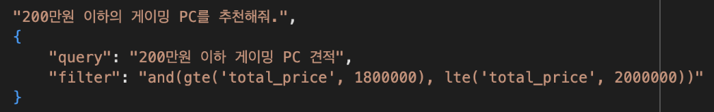

# 🎓 2024년 상명대학교 졸업 작품

## 👫 팀명: 또 너야

## 💻 프로젝트명: 고급 RAG와 LLM 파인튜닝을 이용한 컴퓨터 견적 추천 및 분석 서비스

## 프로젝트 간단한 설명

고급 RAG를 이용하여 사용자의 질문에 맞는 컴퓨터 견적을 추천해주고, 컴퓨터 분석 및 부품에 대해 파인튜닝한 LLM이 견적에 대한 분석적 견해를 제공하여 사용자들이 쉽게 사용할 수 있는 웹서비스입니다.

📄 **자세한 기술 내용은 PDF를 참고해주세요!**

---

## 🛠️ RAG

### 순서: 데이터 수집 -> RAG에 적용 -> 사용자 질문에 대한 알맞은 견적 추출

### 데이터 수집

- **견적 사이트**: 견적왕, 퀘이사존 등과 같은 신뢰성 있는 견적 사이트에서 크롤링을 통해 5000여 개의 견적 데이터를 수집
- **추가 데이터**: 각 부품에 대한 벤치마크 데이터는 PassMark 사이트에서 추출하여 견적 데이터와 매칭, 카테고리를 추가함

### 기본 RAG 설명

- **RAG**(Retrieval-Augmented Generation): 사용자가 긴 문서 내에서 질문을 하면, 임베딩한 DB(벡터DB)에서 리트리버를 통해 시맨틱 서치를 하여 가장 유사한 답변을 추출

### 우리가 적용한 Self-Query 리트리버

- **Self-Query 리트리버**: 기존 RAG의 리트리버 중 추천 알고리즘에서 많이 사용되는 리트리버
  - 메타데이터를 뽑아 유효성 있는 데이터를 만드는 것이 관건
  - 숫자 데이터에 대한 비교와 이상, 이하를 판별하는데 효과적
  - 정규화된 데이터에서는 효율적으로 추출되어 정확도가 대폭 증가함

### 기존 필터에서 더욱 강화된 필터 (강점)

- **기존 필터**: 단순 포함 여부만 따짐
- **강화된 필터**: 스키마 규칙을 보고 필터를 재생성하여 정확도를 높임

  - 예시: "200만원 이하의 컴퓨터 견적을 추천해줘"라는 요청에서 기존 필터는 100만원짜리까지 추천, 강화된 필터는 200만원에 근접한 견적을 추천
  - 필터 생성 예시:

  

  - 퍼포먼스, CPU, GPU 벤치마크, 컴퓨터 부품 이름 등의 데이터를 정제하여 메타데이터에서 1차적으로 필터 수행 후 시맨틱 서치를 할 쿼리문 생성
